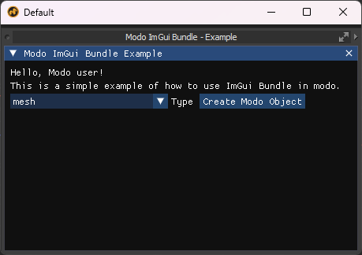

# Modo ImGui Bundle

A Modo kit that integrates Dear ImGui library with Modo for creating custom user interfaces.

## Description

This project provides integration of python [Dear Imgui Bundle](https://github.com/pthom/imgui_bundle) with Modo.

## Features

- Easy integration of ImGui with Modo
- Custom UI components for Modo workflows
- Example

## Installation

1. Install imgui_bundle into your `/python3kit/extra64/Python/Lib/site-packages` directory (manually).
2. Install example kit.
3. Start Exploring :)

## Usage

Click button created in `Kits` (top right of Modo).

## Requirements

- Modo (w/ PySide6)

## License

This project is under the MIT License.

## Contribution

Please feel free to submit a pull request.

## Acknowledgments

- [Dear ImGui Bundle](https://github.com/pthom/imgui_bundle) and associated developers.
